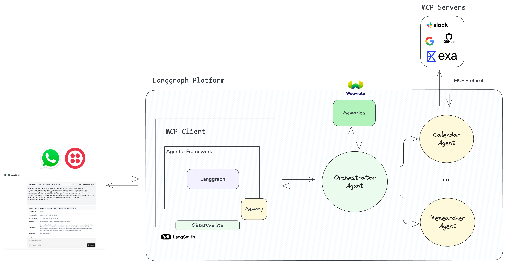

# LangGraph WhatsApp Agent

A template for building WhatsApp agents using LangGraph and Twilio. This project enables you to deploy AI agents that interact with users via WhatsApp, process messages and images, and invoke custom graph-based agents hosted on the LangGraph Platform.

It provides a foundation for building scalable, secure, and maintainable AI agent services.
## Key Benefits

- **Async Processing**: Background task handling prevents connection timeouts and ensures reliable message delivery
- **Production-Ready**: Built with scalability, security, and maintainability in mind
- **Multi-Agent Support**: Supervisor-based architecture for complex workflows
- **Easy Deployment**: Simple deployment to LangGraph Platform

Fork this repo and iterate to create your production-ready solution.

## Features

- Create custom LangGraph-powered agents for WhatsApp
- Support for multi-agents with supervisor-based architecture
- Integration with Model Context Protocol (MCP) servers (Supermemory, Sapier, etc.)
- Support for image processing and multimodal interactions
- Persistent conversation state across messages
- Request validation for security
- Comprehensive observability via LangSmith
- Easy deployment with LangGraph Platform
- Background processing to prevent connection timeouts

## Background Task Architecture

This template implements asynchronous message processing to handle Twilio's timeout limit:

1. **Immediate Response**: When a WhatsApp message arrives, the server immediately returns an empty response to Twilio, acknowledging receipt
2. **Background Processing**: The actual message processing and agent execution happens in a FastAPI background task
3. **API-based Reply**: Once the agent generates a response, it's sent back to the user via Twilio's REST API

This approach ensures:
- No connection timeouts, even for complex agent operations
- Better user experience with reliable message delivery
- Ability to handle long-running tasks (e.g., complex searches, API calls)
- Improved error handling and logging

## Stack

- **WhatsApp Integration**: Twilio API for messaging and multimedia handling
- **Agent Framework**: LangGraph (by LangChain) as the MCP client and multi-agent system using langgraph_supervisor
- **Models**: Supports Google Gemini, OpenAI GPT models, and more
- **MCP Servers**:
  Using langchain-mcp-adapters
  - Supermemory
  - Zapier for access to thousands of apps and integrations (Google, Slack, Spotify, etc.)
- **Observability**: Complete tracing with LangSmith
- **Deployment**: LangGraph Platform for simplified production hosting

## Prerequisites

- Twilio account with WhatsApp Business API or Sandbox
- API key for LLM access (OpenAI, Google Gemini, etc.)
- LangGraph Platform access (for deployment)
- (Optional) MCP server configurations (Supermemory, Zapier, etc.)

## Getting Started

1. Fork this repository to start your own project
2. Build your agent using the template structure
3. Deploy to LangGraph Platform

4. Configure Twilio webhook to point to your LangGraph deployment URL (/whatsapp)

## Customizing Your Agent

### Agent Logic

Modify the agent behavior in `src/agents/base/graph.py`:

- Add new tools and capabilities
- Customize the supervisor logic
- Integrate additional MCP servers
- Implement custom message handling

### Adding New Features

1. **Voice Message Support**: Extend `utils/speech_to_text.py` for voice transcription
2. **Media Processing**: Use `utils/media_utils.py` to handle images and documents
3. **Custom Tools**: Add new tools to your agent graph for specific functionality
4. **Persistent Storage**: Implement database connections for conversation history

## Troubleshooting

### Common Issues

1. **Connection Timeouts**
   - The background task architecture should prevent most timeout issues
   - If timeouts persist, check your agent's processing time in LangSmith traces
   - Consider optimizing your agent's logic or using faster models

2. **Invalid Twilio Signature**
   - Ensure your `TWILIO_AUTH_TOKEN` is correct
   - Check that your webhook URL in Twilio matches your deployment URL exactly
   - If using a proxy/load balancer, ensure `X-Forwarded-Proto` and `X-Forwarded-Host` headers are preserved

3. **Messages Not Received**
   - Verify your Twilio webhook is configured correctly
   - Check server logs for any errors
   - Ensure your WhatsApp number is properly configured in Twilio

4. **Agent Responses Not Sent**
   - Check that `TWILIO_ACCOUNT_SID` and `TWILIO_AUTH_TOKEN` are set correctly
   - Verify the `TWILIO_WHATSAPP_NUMBER` format (should be `whatsapp:+1234567890`)
   - Review background task logs for any API errors

## License

This project is licensed under the terms included in the LICENSE file.